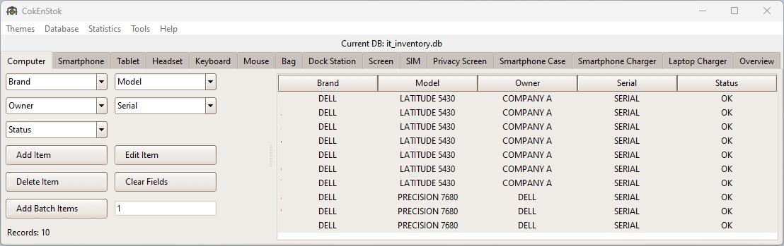
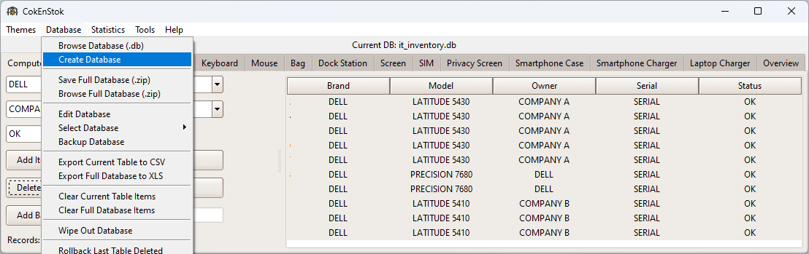
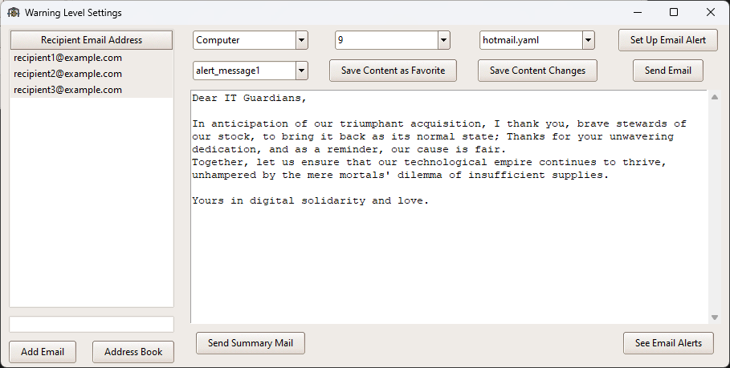
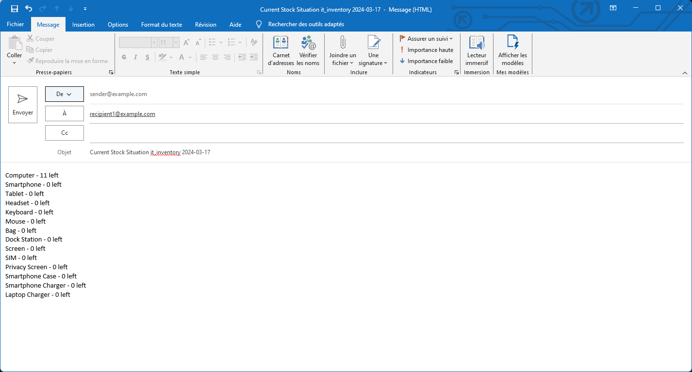
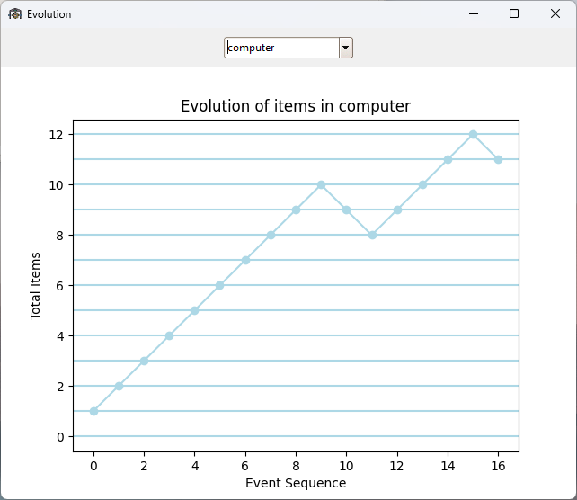

https://github.com/gelndjj/_WORK_CokEnStok/assets/81557672/2662b725-a1f8-461f-8dde-b966048b99a7

# CokEnStok - Dynamic Stock Management Application

CokEnStok is a dynamic stock management tool designed to cater to diverse inventory needs. Whether it's IT assets or general warehouse stock, this desktop application empowers users to create, maintain, and monitor stock databases with ease and efficiency.

## Key Features

- **Custom Database Creation**: Build your own stock database tailored to your specific inventory requirements.
- **Intuitive Editing**: Seamlessly add, remove, and modify stock items within your database to reflect real-time changes.
- **Visualization and Analysis**: Generate insightful graphs with `matplotlib` to visualize stock trends and analyze inventory levels.
- **Email Alerts**: Set up an SMTP account to send out automated email alerts, ensuring you stay ahead of restocking needs and never run out of key items.
- **Recipient Management**: Manage a list of recipients who will receive alerts, keeping all stakeholders informed about stock levels.

## Getting Started

### Prerequisites

Before running CokEnStok, ensure you have the following:

- Python 3.x installed on your system.
- Necessary Python libraries: `ttkthemes`, `tkinter`, `sqlite3`, `openpyxl`, `matplotlib`, `smtplib`, and others as required by the script.

### Installation

1. Clone the repository to your local machine or download the `CokEnStok.py` file.
2. Install all required dependencies using `pip`:
   ```sh
   pip install ttkthemes tkinter sqlite3 openpyxl matplotlib smtplib

### Screenshots
|  |  |
|:---:|:---:|
| Main Screen | Sub Menu |
|  |  |
| Set Email Alert | Sum Email |
|  | |
| Graphic Evolution | |

### Contact
[LinkedIn](https://www.linkedin.com/in/jonathanduthil/)

